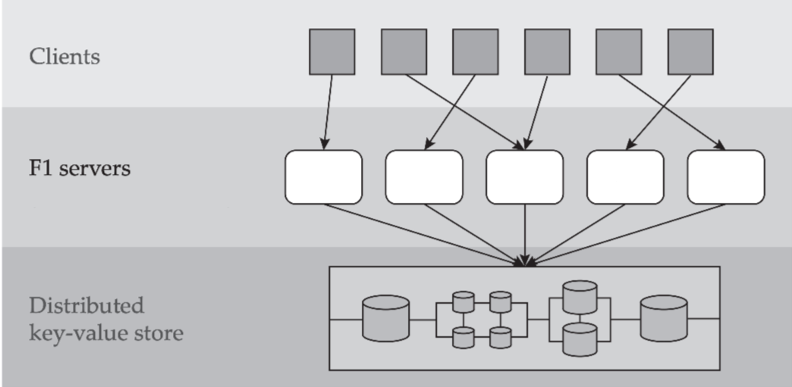
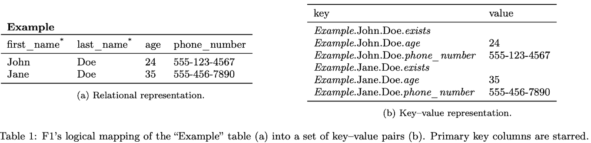
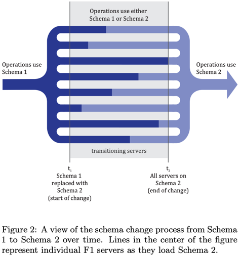
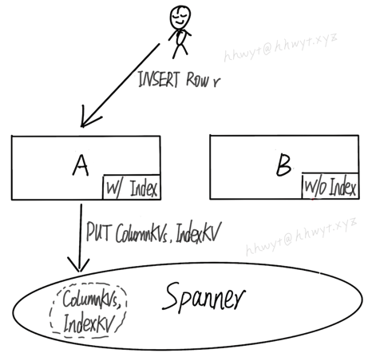
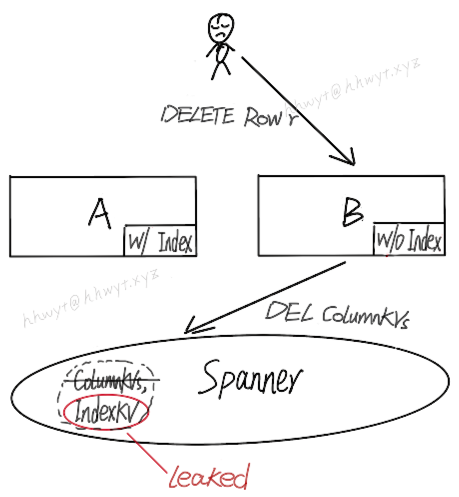
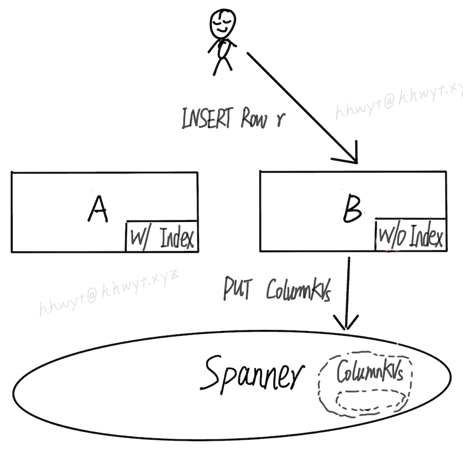
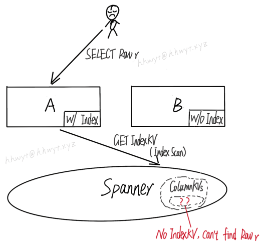
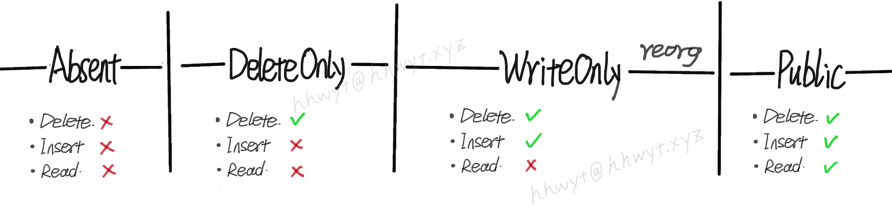
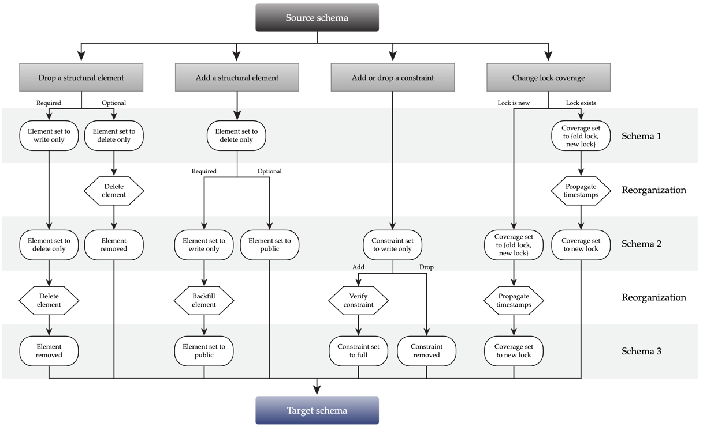
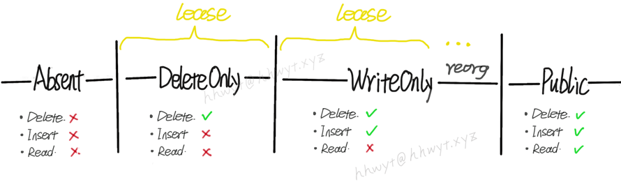

## 摘要

F1 团队发表的论文 [Online, Asynchronous schema change in F1](https://static.googleusercontent.com/media/research.google.com/zh-CN//pubs/archive/41376.pdf) 针对具有「无状态计算层」，「共享存储层」和「没有全局成员列表」的分布式数据库提出了一种 Schema 变更的方案，该方案具备在线（不加锁，不阻塞 DML），异步（允许集群中的不同节点在不同的时刻切换到新版本的 Schema）的特点，同时论文中也提到了该方案在 F1 数据库中的实现。本文试图以尽量「通俗易懂」的文字，以及「形象生动」的图示，帮助读者快速理解该方案的设计与实现。通篇阅读本文耗时约 20 分钟。

## 背景

### F1 总览

F1 是 Google 家的一款分布式关系数据库，它具备以下特点：

- Massively distributed

  - 全球数百个节点（论文是 2013 年发布的，个人感觉这个数量级在当年应该无出其右）。

- Stateless servers

  - F1 集群作为无状态的 SQL 计算层。客户端可以连接任意一台 F1 server，甚至同一事务中的不同语句都可以被不同的 F1 server 处理。

- Shared data storage

  - Spanner 集群作为共享的存储层。F1 把它当做 Key-Value Store 来使用，所有的 F1 server 都可以访问存储其中的所有数据。

- Relation Schema

  - F1 作为一个关系数据库，其 Schema 是数据库中一系列对象的定义。这些对象包括：Tables，Columns，Indexes，Constraints 等。Schema 信息存储在 Spanner 中，为提升性能，每个 F1 Server 内存中都有一份完整拷贝，F1 运行时以内存中的 Schema 为准。Schema 变更需要更新所有的 F1 server。

- No global membership

  - F1 不存储全局成员列表。一来没有必要存，二来即便有全局成员列表，也没办法用它来做 F1 集群的全局同步，毕竟全球节点间的通信代价不菲。

F1 架构图 

### 数据表示

F1 是一个典型的「SQL on NoSQL」的架构，关系数据库中的 Row（或者说 Tuple）会转换成 KV 存储在 Spanner 中。

每张表都有一个 Primary Key。表中的一行数据并不是整体打包成一个 KV 存储在 Spanner 中的，而是将每一行中每一列的值单独作为一个 KV 存储。Key 由表名，主键名和列名拼接而成。为了方便后文描述，我们将这种存储数据的 KV 记做 ColumnKV，同时将组成一整行数据的所有 ColumnKV 看做一个整体，记做 ColumnKVs。

此外，F1 也支持 Secondary Index。由表名，列名和列值拼接成 Key，Value 即对应的 Primary Key。为了方便后文描述，我们将这种 Index 的 KV 记做 IndexKV。

这里贴上论文中给出的一张示意图，非常直观。

### Schema 变更方案的限制

F1 是 Google 的关键支撑系统，它必须得时刻保持稳定可用，否则会影响 Google 的收入。这要求它的 Schema 变更方案必须是**在线**的，不能阻塞 DML，对 DML 响应时间的影响也要尽可能小。

同时由于其全球部署，没有全局成员列表的特点，我们也没法同步地让整个 F1 集群在同一时刻切换到新版本的 Schema。因此，Schema 变更方案必须是**异步**的。换句话说，F1 server 会独立自主地加载 Schema，当且仅当某一时刻集群中所有的 F1 server 都切换到了新版本的 Schema，Schema 变更才算完成。

## Schema 变更

> There is nothing as practical as a good theory. — Kurt Lewin

### 数据库的一致性

一个正确的 Schema 变更方案必须保持数据库的一致性。因此，在介绍 F1 的 Schema 变更方案前，我们先来了解一下数据库的一致性。

我们说 F1 数据库是一致的，当且仅当：

1. 所有 ColumnKV 都能找到一个包含它的 Row 和 Table。
2. 所有 Row 都包含所有非空列的 ColumnKV。
3. 所有 IndexKV 都能找到一个包含它的 Index。
4. 所有 Index 都是完整的（不存在某个 Row 缺少指向它的 IndexKV）。
5. 所有 IndexKV 都指向有效的 Row。
6. 没有违反 Constraint 的数据。
7. 不存在未知的 KV（特指除上述 1，3 以外的未知 KV）。

根据上述定义可归纳出数据库不一致会呈现出的两种异象：

1. 孤儿数据（orphan data anomaly）        — 违反 1，3，5，7
2. 数据不完整（intergrity anomaly）          — 违反 2，4，6

因此，一个 Schema 变更方案只有完全杜绝了这两种异象，才能算是正确的。在这个要求下，F1 的 Schema 变更方案该如何设计？

###  一步到位？此路不通

如果不假思考，可以很容易给出一个破绽百出的方案，笔者将之称为「一步到位」方案。

「一步到位」方案是怎么样的？

我们给每个 Schema 关联一个状态，表示 Schema 所定义的对象的可用状态，也可以理解为 Schema 对不同操作的可见程度。

「一步到位」方案中 Schema 会有两个状态：

- Absent 
  - 此状态下 Schema 不存在，定义的对象不可用。Schema 对所有操作不可见，不可读写。
- Public
  - Schema 已变更完成，定义的对象完全可用。Schema 对所有操作可见，定义的对象可读可写。

对于创建 Schema 的场景，Schema 一开始不存在，处于 Absent 状态。Schema 写入 Spanner 后，直接进入 Public 状态（删除 Schema 的场景状态转换正好相反）。这两个状态之间的转换是直接的，没有任何中间状态，一步到位，所以称做「一步到位」方案。

「一步到位」方案在这里作为一种直觉先行的方案，未经过理性论证。在 F1 异步 Schema 变更的场景下，它会存在哪些问题呢？我们不妨以 CREATE INDEX 为例来分析一下。

G

 orphan data anomaly

上图中有两个 F1 server：A 和 B。CREATE INDEX 会创建一个 Index 的 Schema，server A 已加载这个 Schema，server B 未加载。

首先客户端执行一条 INSERT，插入一行数据 r。这条语句被 server A 执行，server A 已加载这个 Index 的 Schema，所以会同时插入这行数据对应的 ColumnKVs 和 IndexKV。

接着客户端执行一条 DELETE，想删除先前插入的那行数据 r。这条语句被 server B 执行，server B 未加载这个 Index 的 Schema，它只会删除这行数据对应的 ColumnKVs。很不幸，IndexKV 被遗留在 Spanner 中，成为了一条非法的孤儿数据。

另外一种场景如下图：

 data integrity anomaly

客户端先执行一条 INSERT，插入一行数据 r。这条语句被 server B 执行。server B 由于未加载这个 Index 的 Schema，只会插入这行数据的 ColumnKVs，不会插入对应的 IndexKV。

接着，客户端执行一条 SELECT，想查找先前插入的数据 r。这条语句被 server A 执行。server A 已加载这个 Index 的 Schema，正好优化器选择走 Index Scan，需要去 Spanner 中查找对应的 IndexKV。然而由于 IndexKV 不存在，导致查不到数据 r，只能返回空。这就是一个数据不完整的带来的 BUG。

经过以上分析可知，「一步到位」方案，不但会导致孤儿数据，也会导致数据不完整。此路走不通，那我们该怎么办呢？

（瞎扯）也许是 F1 的工程师之中有我们社\*会主义的接班人，受我国经济建设「三步走战略」启发，他们发现 CREATE INDEX 实际上也可以通过三步走来实现，一举「歼灭」这两个异象，实现正确的 Schema 变更。

### 「三步走」方案

「一步到位」方案中，Schema 只有两个状态：Absent 和 Public。「三步走」方案，额外引入了两个中间状态，即 DeleteOnly 和 WriteOnly。从 Absent 到 DeleteOnly，再到 WriteOnly，最后到达 Public，不多不少，正好三步 :)

这里说明一下 DeleteOnly 和 WriteOnly 这两个状态：

- DeleteOnly
  - 如果是 Index 的 Schema，只对 Index 的 delete 操作可见。更进一步，由于 update 操作会拆分为 delete 操作和 insert 操作，只对这个 delete 操作可见，忽略掉 insert 操作。对于 read 操作不可见。
  - 如果是 Table 或 Column 的 Schema，只对 Table 或 Column 的 delete 操作可见，对于 update，insert，read 操作不可见。
- WriteOnly
  - Schema 对所有 write 操作可见，包括 delete，update，insert。对 read 操作不可见。

 CREATE INDEX 的 Schema 状态转换图 

根据上图可知，Index 的 Schema 如果是 Absent 状态，Index 不可读写；DeleteOnly 状态，Index 仅支持删除；WriteOnly 状态，Index 仅支持写；Public 状态，Index 可读可写。「三步走」方案，一步一个脚印，循序渐进地完成了一个 Index 从无到有的创建过程。（reorg 即 reorganization，是指数据重新组织，后文会介绍）。

同时「三步走」方案依赖于一个限制：**同一时刻 Schema 在集群中最多存在两个状态。**

这个限制旨在简化问题。由于 Schema 是一个状态接一个状态进行转换的，在这个限制下，我们只要保证每次从当前状态转换到下一个状态不会导致数据库出现一致性问题，那么「三步走」方案就是正确的。

接下来我们探讨一下「三步走」方案在 CREATE INDEX 场景下正确性。

首先给出一个定义，**任何 Schema 变更从 $s_{1}$ 到 $s_{2}$ 能够保持数据库一致性，当且仅当**：

- **任何作用于 Schema $s_{1}$ 上的操作 $op_{s1}$ 不影响 Schema $s_{2}$ 状态下的一致性，并且**
- **任何作用于 Schema $s_{2}$ 上的操作 $op_{s2}$ 不影响 Schema $s_{1}$ 状态下的一致性**

本文限于篇幅，不给出详细论证。这里可以非形式化地思考一下，同一时刻 F1 集群中会存在 Schema 的两个状态 $s_{1}$ 和 $s_{2}$。客户端执行多条 SQL 语句，可能先在 Schema $s_{1}$ 下执行一部分，然后在 Schema $s_{2}$ 下执行另外一部分；也可能先在 Schema $s_{2}$ 下执行一部分，然后在 Schema $s_{1}$ 下执行另外一部分。后者实际上相当于 Schema 在做 $s_{2}$ 到 $s_{1} $ 的状态变更。因此，从当前状态转换到下一个状态要想保持数据库的一致性，从下一个状态转换到当前状态也必须保证数据库的一致性。符合此条件的两个状态，可以称它们是兼容的。

由此可知，Schema 变更方案中相邻状态必须兼容才能保证正确性。在「一步到位」方案中，Absent 和 Public 这两个状态是不兼容的，前文已经分析过。如果我们只添加一个中间状态 DeleteOnly，能否解决问题呢？

首先，Absent 状态和 DeleteOnly 状态是兼容的，因为：

1. Absent 状态和 DeleteOnly 状态下的 Schema 对 insert 操作不可见，这两个状态下不会新增数据，自然也不存在孤儿数据的问题。
2. Absent 状态和 DeleteOnly 状态下的 Schema 对 read 操作不可见，不要求数据完整性，所以不存在数据不完整问题。

但是，DeleteOnly 状态和 Public 状态是不兼容的。与上面两个状态类似，这两个状态间的转换也不会存在孤儿数据的问题。但是，由于 Public 状态下的 Schema 对 read 操作可见，所以要求数据必须是完整的。然而 DeleteOnly 状态直接转换到 Public 状态会导致数据不完整，原因和前文分析过的从 Absent 状态转换到 Public 状态一样，不再赘述。

没办法了，只能再引入一个 WriteOnly 状态。

DeleteOnly 状态和 WriteOnly 状态显然是兼容的，它们不存在孤儿数据问题也都不要求数据完整。WriteOnly 状态和 Public 状态也是兼容的，因为：

1. WriteOnly 和 Public 两个状态下的 Schema 都对 delete 操作可见，杜绝了孤儿数据问题。
2. WriteOnly 状态下，会对存量和增量数据进行处理，以保证数据的完整性。CREATE INDEX 在这个状态下：（1）写入增量数据的同时自动添加 IndexKV。（2）在转换到 Public 状态前，为所有存量数据补全 IndexKV，即所谓的 reorg。

通过以上分析可知，「三步走」方案通过引入两个必要的中间状态，保证了状态转换中相邻状态都是兼容的，正确地实现了 CREATE INDEX 这个 Schema 变更。我们引申触类一下，便能用该方案来解决其他类型的 Schema 变更问题。

### 其他 Schema 变更

简单举几个例子：

**DROP INDEX**

DROP INDEX 是 CREATE INDEX 的逆变更，实际上逆序做一遍 CREATE INDEX 的状态转换就可以了（Public -> WriteOnly -> DeleteOnly -> Absent）。原因也很好理解，一来 DROP INDEX 也不能一步到位，二来相邻状态已被证明过都是兼容的，逆序转换是能够保持数据库一致性的。不过要注意的是，DROP INDEX 中 reorg 这一步骤实际要做的是删除这个 Index 的所有 IndexKV，这一步应该在进入 Absent 状态前完成。

同理，其他所有 Schema 变更的逆变更都可以这样解决。

**ADD COLUMN DEFAULT NULL**

由于新增的这一列允许为 NULL，也就是说不要求数据绝对完整，这列数据可有可无。那么 WriteOnly 状态可以不要了。「三步走」方案直接优化为「两步走」方案（Absent -> DeleteOnly -> Public）。

**ADD CONSTRAINT**

ADD CONSTRAINT 不存在孤儿数据的问题，所以 DeleteOnly 状态就可以不要了。同样直接「两步走」方案搞定 （Absent -> WriteOnly -> Public）。

上图是论文中给出的所有 Schema 变更的状态转换。其中 Change lock coverage 是 F1 特有的机制，略去不表。

structural element 可以简单理解它就是各种对象的 Schema。

Optional 的 Schema 不要求数据的完整性，比如前文刚提到的 ADD COLUMN DEFAULT NULL。

Reorgnaization，即前文提到的 reorg。这个阶段，对 CREATE INDEX 来说就是为存量数据补全 IndexKV。对 ADD COLUMN NOT NULL 来说，就是为存量数据补全 ColumnKV。此阶段就是一些数据重新组织。

## 实现

实践中，Schema 的每一个状态对应一个 Schema 版本。因此，**「三步走」/「两步走」方案可以理解为是一种多版本 Schema 的方案，方案正确性的前提是保证同一时刻集群中最多只能有两个版本的 Schema 生效**。

### Schema lease

F1 没有全局成员列表，如何协调 F1 server 一步步地做 Schema 的版本变更，并且保证同一时刻集群中最多只能有两个版本的 Schema 生效呢？

F1 团队给出的答案是 Schema lease。每个 F1 server 都会被授予一个 Schema 的 lease，lease 时长通常为数分钟，F1 server 需要在 lease 过期前重新续约（F1 的实践是 lease 时长过了一半就续约），并按需加载新版本的 Schema。如果不能成功续约，则 F1 server 直接自杀（托管系统会自动重启它）。

 CREATE INDEX 的 Schema 状态转换图（包含 lease） 

由于每过一个 lease，Schema 才会重新加载一次。因此，每一个中间状态至少持续 1 个 lease。另外，由于 WriteOnly 状态需要做 reorg，通常持续时间更长。所以，这个方案会导致 DDL 操作都比较耗时。

### Write fencing

用户事务允许跨越多个 lease。但是，如果用户事务中有写操作，写操作不允许持续时间超过 1 个 lease，否则可能会违反同一时刻集群中最多只有两个 Schema 版本生效的限制。可以通过 Spanner 的 Write fecing 机制来约束写操作，简单来说，就是给写操作设置一个 deadline，超时则不允许提交。这个方法很管用，简单粗暴，但这会导致 DML 写事务可能会由于写太长被 abort。

### Garbage collection

类似 DROP INDEX 这样的 Schema 变更，都需要删除数据。F1 有效利用 Spanner 的 GC 机制，Schema 变更过程中删除数据只是逻辑删除，由 Spanner 的 GC 在晚些时候对这些数据做物理删除。

### Schema change process

F1 不支持 DDL 语句。这是因为 F1 团队认为使用单独的 DDL 来实现 Schema 变更效率低下，反而批量并行执行 Schema 变更可以均摊掉耗时操作（例如：reorg）的代价。出于这个考虑，F1 团队将 Schema 记录在一个 Proto Buffer 文件中，使用版本控制系统 （VCS）来管理。开发人员如有 Schema 变更需求，就更新这个文件。管理员每周两次获取该文件的更新，批量执行一段时间内积攒的 Schema 变更。（笔者的理解，F1 实现的 Schema 版本是 Database 级别的，而不是 Table 级别的。因此使用 DDL 的话，同一个 Database 的 DDL 都得串行执行。相对的，在批量并行执行中，一个 Schema 版本可以包含多个关系数据库对象的 Schema 的中间状态，故相对高效）。

## 总结

F1 通过引入多版本的 Schema，并且限制同一时刻集群中最多只能有两个版本的  Schema  生效，解决了分布式数据库在线异步变更 Schema 的难题。但是该方案仍然存在一些瑕疵，如 DML 写事务可能会由于写太长被 abort，并且 DDL 操作比较耗时。另外，如果试图在该方案的基础上，完整实现 DDL 的事务特性（ACID，SubTransaction），也是一个比较棘手的问题。本文先写到这里，后面如果有空，笔者会再写一下该方案在业界其他数据库中的一些实现以及优化。

## References

[1] I. Rae et al. Online, asynchronous schema change in F1. PVLDB, 6(11), 2013.

 
>本文作者：hhwyt
>
>本文链接：https://hhwyt.xyz/2021-03-27-online-async-schema-change-in-f1
>
>版权声明：本博客所有原创文章均采用 [CC BY-NC-SA 4.0](https://creativecommons.org/licenses/by-nc-sa/4.0/) 许可协议。转载请注明出处！

