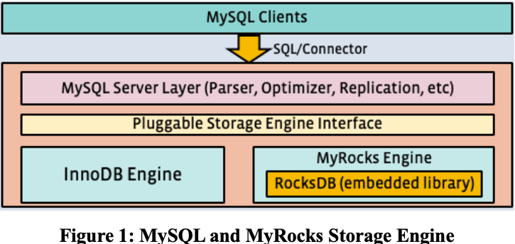
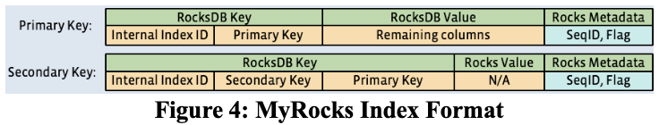
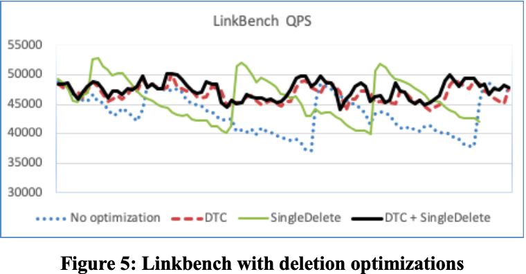
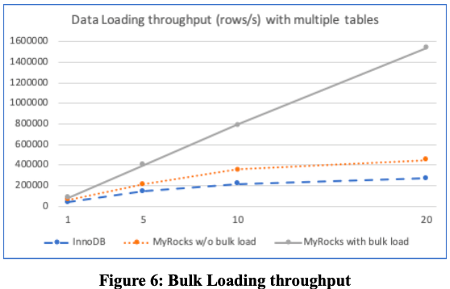
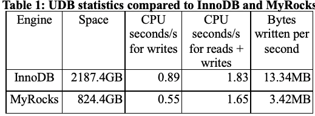

欢迎关注我的微信公众号：黄金架构师。

---

本文介绍一下 Facebook 的论文：MyRocks: LSM-Tree Database Storage Engine Serving Facebook's Social Graph.

这篇论文介绍了 Facebook 为自己的 MySQL 集群开发的 MyRocks 存储引擎，以及将现有的负载从 InnoDB 迁移到 MyRocks 的一些工作。

Facebook 想寻找一款写放大和空间放大更好的存储引擎来替换掉基于 B-tree 实现的存储引擎 InnoDB。RocksDB 基于 LSM-tree 实现，正好满足这个要求。于是 Facebook 基于 RocksDB 开发了 MyRocks。不过，LSM-tree 在读性能方面相对 B-tree 更差一些，Facebook 在这方面做了很多优化，下文会详细说一下。

MyRocks 中每个索引会分配一个 index id。每张表的索引分为主键索引（聚簇索引）和二级索引。主键索引的 key 是 index id + primary key，value 是一整行的数据。二级索引的 key 是 index id + secondary key + primary key，以保证 key 在 rocksdb 中唯一，value 是 null。

黄金架构师观点：按照这种实现方式，针对二级索引的一个等值查询（lookup），会转化成给定前缀进行范围查询（range scan），LSM-tree 中 range scan 开销很大，因此，range scan 的性能是务必要优化的。

我们来总体看一下 MyRocks 做了哪些优化。

**Mem-comparable Keys**

Lsm-tree 中 key 比较是显著多于 B-tree 的。尤其是 range scan。range scan 在 B-tree 中只需要二分搜索一个 B-tree，而在 LSM-tree 需要二分搜索每一层的 sorted run。
为了优化 key 比较的性能，MyRocks 中所有 key 都是以 bytewise-comparable 编码进 RocksDB 的，这样 key 比较就可以用原生的 memcpy 直接比较，无需 deserializing 和做一些 type-specific 比较。（具体编码方式见参考 2。）

**Reverse Key Comparator**

RocksDB 中对 key 做了前缀压缩，所以逆序扫描会比较慢。MyRocks 这里支持把 key 直接逆序存储，以优化特定的逆序扫描多的场景。

**Faster Approximate Size to Scan Calculation**

Mysql 的 planer 会主动问存储引擎要扫描的数据量以优化查询计划。MyRocks 在这里做了两个优化，一是如果用户使用了 force index 要求强制走索引，就不进行扫描数据量的估算。二是针对必须估算的场景做了一些估算算法的优化。

**Prefix Bloom Filter**

Facebook 的场景有大量的 range scan，除此以外，上文也提到过，针对二级索引的等值查询在 MyRocks 这里也是 range scan。range scan 需要从每一个 sorted run 读上来一个 block，即便是没有 key 在要找的范围内的 sorted run。这意味着很多的 IO 及 CPU 解压缩开销。

因此，这里为 RocksDB 引入了 Prefix Bloom Filter，用户可以指定 key 的特定长度的字节作为「prefix」，为此生成 Bloom Filter。这样，当一个 sorted run 中不存在要找的范围内的 key 时，就可以直接过滤掉。
通过 Prefix Bloom Filter，二级索引的等值查询场景得到大大优化。

**Reducing Tombstone on Deletes and Updates**

RocksDB 中的删除操作和更新操作都会追加一个 tombstone，这些 tombstone 只有在到达 LSM-tree 的最下面一层 LMax 时才会被删除（如果在中间层删除，下面层可能还有 key 的多个旧版本，就会有问题）。
当 tombstone 变得很多，range scan 的性能就会下降。

为了解决这个问题，这里为 RocksDB 引入了 SingleDelete 功能。

SingleDelete 有一个假设，要删除的 key 在 RocksDB 中最多只有一个版本存在。这样 SingleDelete 生成的 tomstone 在中间层 compaction 时遇到这个唯一的版本就可以「同归于尽」，两个一起被回收。

这个假设比较严苛。幸运的是，二级索引的场景正好满足这个假设。新增一行数据，会向二级索引插入一个 key，更新二级索引的索引列的值（更新这个 key），会先删除这个 key，再新增一个新的 key。这里删除这个 key 的时候，这个 key 只有一个版本，就可以用到 SingleDelete。
因此，二级索引的索引列更新密集的场景，tomstone 减少了，range scan 性能得到优化。

**Triggering Compaction based on Tombstones**

在执行删除大量数据的操作后，会产生大量的 tombstone，影响 range scan 的性能。这里引入了 Deletion Triggered Compaction(DTC)。实现上就是在 flush 或 compaction 的时候，如果检测到删除大量数据的操作，就再 trigger 一个额外的 compaction。

如下图是 Facebook 用 Linkbench 负载测试了 DTC 和 SingleDelete 的优化效果，测试结果显示同时使用 DTC 和 SingleDelete 吞吐量较高，性能更平稳。

**DRAM Usage Regression**

维护 Bloom Filter 会带来不小的内存开销，LSM-tree 的最后一层会存储绝大多数的数据，Bloom Filter 也最大。这里扩展了 RocksDB 让它支持最后一层不创建 Bloom Filter 来节省内存。这里相当于用访问最后一层的 CPU 和 IO 开销换取了内存用量。

**SSD Slowness Because of Compaction**
Compaction 删除文件后需要执行 SSD 的 Trim 命令以优化 SSD 内部写放大和提升性能，然而有一些 SSD 执行完 Trim 后会有暂时的性能下降。所以引入了一个 rate limiter 来限制删除文件操作的频率。
此外，compaction 也会和前台线程争抢 IO，这里同样是用 rate limiter 来限制 compaction 的 IO 请求。

**Physically Removing Stale Data**

LSM-tree 中物理删除的 tomstone 或者逻辑删除（覆盖一个 key 设置它的 value 为 null）的 key 可能一直存在于最上面几层，无法到达最下面一层 LMax。数据迟迟得不到回收。
这里引入 Periodic Compaction 来解决这个问题。配置一个时间周期，每过个一个周期，主动对 SST file 做 compaction，将它推向下一层。这个方案保证了删除的数据在一定时间内一定会被回收。

**Bulk Loadind**

支持 Data Ingestion 直接攒批写到 LMax 层的 SST file，而不是一行一行写入 RocksDB，以提升写性能。

**Replace and Insert Without Reads**

支持 REPLACE 语法做单行写入，与 INSERT 不同，REPLACE 语法不进行 unique key checks，避免随机读的开销。

INSERT 也支持指定参数跳过 unique key check，由用户来保证 unique。

黄金架构师观点：这里的优化是必须的也是非常关键的。否则用 RocksDB 来实现索引，听起来性能很不错，写性能很高，读性能有 Bloom Filter 还凑合。然而，对于关系数据库，一张表可能有多个 unique key，也可能有外键，任何写操作，都伴随着数个先行的 unique check 读操作，这会导致 RocksDB 的相对 B-tree 的写性能优势被抹除，再也拿不出手了。

**More Compression Opportunities**

支持对不同层的数据采用不同的压缩算法，层数越高，compaction 活动越少，可以用压缩开销越大的重量级压缩算法。

**评估**

论文中给出的结果显示，MyRocks 的写性能优于 InnoDB，读性能和 InnoDB 也是 comparable 的。

**总结**

LSM-tree 实现关系数据库的存储引擎（包括数据存储和索引）是可行的。

空间占用有优势。
写性能有优势（应该是写不进行 unique check）。
读性能搞一些优化后也还可以。
至于 MyRocks 是否超越了 InnoDB 嘛，嘿嘿嘿~

**参考**
1. MyRocks: LSM-Tree Database Storage Engine Serving Facebook's Social Graph
2. https://github.com/facebook/mysql-5.6/wiki/MyRocks-record-format#memcomparable-format
