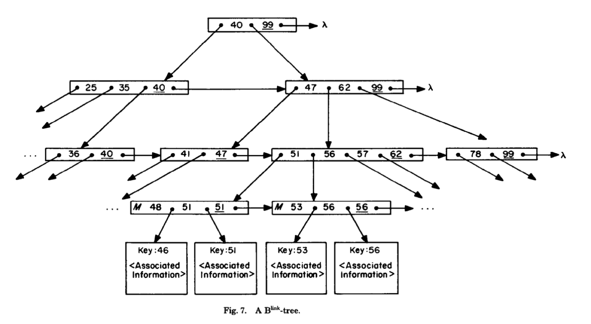
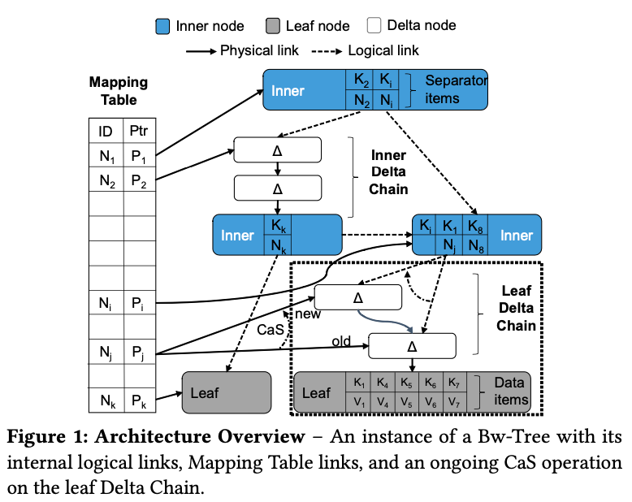

最近要在组内做个分享，讲一下 B-tree 并发控制的演进。由于最近大半年我一直在搞 LSM-tree，B-tree 的东西有点忘了，于是打算写下这篇文章打个草稿回忆一下，同时也希望对看到这篇文章的读者有一些帮助。

首先，B-tree 的并发控制指的是什么呢？我们知道，在数据库中，有两种锁，一种叫 Lock，用来锁一些逻辑的对象（e.g., 表锁，行锁）以支持事务并发控制；另一种叫 latch，用来锁一些物理的数据结构（如 B-tree 并发读写加的锁）以实现数据结构的正确读写（search/insert/delete）。本文要讲的 B-tree 的并发控制的演进，指的就是这个 B-tree 上的 latch 的一个演进（优化）的历程。

本文假定读者对 B-tree 的一些基础知识有一些了解。

我们思考一下，B-tree 并发控制要解决什么问题呢？我在这里直接给出答案，解决 B-tree 并发读写过程中遇到的两个异象：

1. **正在读取/写入的结点被并发线程篡改，读到不一致的结点状态**。例如我正在读或写一个结点的数据，恰好这时有另外一个并发写线程，在这个结点上插入新的数据，结点内的数据发生移动，导致我读到了错误的数据或把结点数据写坏了。换句话说，读写并发和写写并发都要保证/维持结点数据的一致性。
2. **子结点指针失效**（invalidation）。我刚从父结点读到了子结点的指针，这时有一个并发写线程把子结点写满了，子结点发生了 split，一部分数据挪到了子结点右边的新结点上去了。我要读的数据就在这些被挪走的数据之中，接下来我拿着子结点的指针去访问子结点，就找不到要读的数据了，这就产生了一个错误的结果。(子结点发生 merge 也会导致类似的问题。)

为了解决这两个异象，最简单粗暴的方案就是**在读写 B-tree 时，直接加一把整个 B-tree 级别的大锁**。search 操作加读锁，insert/delete 加写锁。
很显然，这个方案虽然把问题解决了，但由于它的锁粒度太粗了，导致 B-tree 只能串行读写，性能有很大问题。

我们有一个优化的方案：**latch crabbing**。latch crabbing 方案锁的粒度降低到 B-tree 结点级别，对结点加读写锁。
具体的规则是：
1. Search 操作下降过程中自上而下对结点加读锁。获得子结点的锁后，可立即释放父结点的锁。
2. Insert/delete 操作下降过程中自上而下对结点加写锁。获得子结点的锁后，判断子结点是否 safe，如果是，可立即释放所有祖先结点的写锁。

对于子结点来说，什么是 safe？safe 就是对于 insert 操作，子结点不会因为插入一条记录就满了需要 split；对于 delete 操作，子结点不会因为删除一条记录就低于半满了需要 merge。如果发生这两种情况，我们还需要在 split/merge 后更改父结点中的子结点的指针信息，需要加父结点的写锁。这是一个自下而上的加锁，与我们制定的自上而下的加锁规则顺序相反，极易造成死锁。因此，我们必须要避免这种情况出现，只有在子结点 safe 的情况下，才会释放所有祖先结点的写锁。

Latch crabbing 方案为什么解决了上面那两个异象。
- 对于异象 1，latch crabbing 方案读写结点都是加锁的，自然没有一致性问题。
- 对于异象 2，latch crabbing 方案如果子结点要发生 split/merge，一定是持有父结点的写锁的。其他线程拿不到父结点的锁会等待，不会存在刚好从父结点读到子结点的指针后，子结点发生了 split/merge 的情况。

综上，latch crabbing 方案确实是能够很好的工作的。

点评一下，latch crabbing 方案相对于锁住整棵树方案，大大提高了并发度，性能得到了提升。不过我们还能看到一些提升空间，比如根结点上读写锁竞争比较激烈，以及子结点不 safe 还有可能锁住子树。

    

再进一步思考一下，子结点不 safe 的情况很常见吗？我们可以积极乐观点假设它不常见。那么有了一个新的方案：**optimistic latching**。

Optimistic latching 方案具体加锁规则是：
1. Search 操作跟 latch crabbing 方案一样。
2. Insert/delete 自上而下加结点的读锁。到达叶子结点后，对叶子结点加写锁。判断叶子结点是否 safe。如果不 safe，放锁，然后用悲观的 latch crabbing 方案重试。

    

显然，这个乐观的方案在写不密集的场景（很少发生 split/merge）性能会表现的很好。然而有时候我们不能盲目乐观。那我们还得沿着悲观的方向继续优化。我们都知道，解决锁竞争的最好办法，就是不用锁，也就是无锁（Lockless）。

    

**Blink-tree** 提出了一个读不加锁，写加结点写锁的方案。
Blink-tree 假设能把每个结点（对应磁盘上的 page）原子的从磁盘上读到线程的私有内存，写操作需要把结点从内存中（page）刷到磁盘。在这个假设下，异象 1 已经解决一半了，原子读结点使得读写并发不会产生异象 1 了。只剩下写写并发产生的异象 1。
我们接下来再看看 Blink-tree 是如何解决写写并发的异象 1，以及异象 2 的。

Blink-tree 每个结点新增两个东西：
1. Right sibling 指针，指向结点的右邻居结点。
2. High key，存储结点内最大的 key。

这两个东西干什么用呢？我们先看一下 Blink-tree 的加锁规则：
1. Search 操作不加锁。下降到达子结点后，如果子结点上的 high key 小于我要搜索的 key，说明子结点发生了 split（可能一次或多次），我要找的 key 已经被挪到右边某个邻居结点去了，就沿着子结点的 right sibling 在同一层上按从左往右的顺序查找，直到在右边某一个邻居结点上找到我们要找的 key。
2. Insert 操作的下降阶段不加锁。到达叶子结点后，对要插入的叶子结点加写锁。如果需要 split，则对父结点再加写锁。如果发现父结点中该叶子结点的指针 key 已经不在了（通过判断 high key 发现子结点的指针 key 已经不在了）说明别的子结点触发了父结点的 split。那我们要沿着父结点的 right sibling 指针一直向右找，找到新的父结点。向右找的过程需要先加父结点右邻居的写锁，再释放父结点的锁。这个过程中，最多只加 3 个结点的写锁（子结点，父结点（或父结点右边第 N 个结点），父结点右邻居结点（或父结点右边第 N + 1 个结点））。注意一下，如果插入父结点后，父结点满了，需要递归向上做上面的流程。
3. Delete 操作，和 Insert 操作类似，需要设计一个 low key，left sibling 之类的东西，本文为了简化，就不提 delete 操作了，大家感兴趣的可以自行搜索一篇论文《A SYMMETRIC CONCURRENT B-TREE ALGORITHM 》。

在上述规则中，
- 对于异象 1， 读操作原子读结点解决了读写并发的异象 1，写操作加结点写锁解决了写写并发的异象 1。
- 对于异象 2，通过判断 high key 确认在子结点指针是否失效，如果失效，沿着 right sibling 指针向右找到新的子结点，保证了指针的有效性，解决了异象 2。

看起来 Blink-tree 方案很完美，读不加锁，写加常量数量的锁（最多 3 个），并发度非常高，性能很好。其实这里我们仍然能找到那么一点点瑕疵，就是 Blink-tree 对于原子读一个结点的假设有点不切实际，工程上数据库的实现出于性能的考量往往都是用共享的 buffer pool 来统一管理 B-tree 结点的内存，buffer pool 中的 buffer（B-tree 结点）是不能原子的读取的。这个问题不太好解决。在 Postgres 中，索性对于结点的读取就通过读锁来实现了。虽然是读锁，相对于 latch crabbing 方案，读锁持有时间会更短一些，父结点的锁读完就可以立即放，不需要等待加上子结点的锁后才能放。

那么，还有没有更好的办法，来解决这个原子读取结点数据的问题？

有！

还有两个方案，用两种不同的思路解决了这个问题。

    

首先说一下读无锁的 **OLFIT tree** 方案。OLFIT tree 在 Blink-tree 的基础上，每个结点上记录一个结点版本号，对于结点的写操作会增加版本号，结点的读操作在读之前记录一下版本号，在读取后再校验一下版本号，如果版本号变了，就重新读取一遍。
具体的加锁规则就很简单了：
1. Search 操作不加锁，只校验版本号（这种方式其实也相当于一种结点的乐观锁）。
2. Insert/delete 操作与 Blink-tree 的加锁方式一样。

显然，异象 1 和 异象 2 在这里也得到了很好的解决。

    

其次看一下读写都无锁的 **Bw-tree** 方案。Bw-tree 中每个B-tree 结点挂一个无锁链表，对 B-tree 结点的增量更新（插入和删除，上图中表示为 Δ）不会 in-place 地改 B-tree 结点的数据，而是把更新操作记录下来插入到到结点的无锁链表的头部，无锁链表的尾部结点指向它对应的 B-tree 结点。我们拿到无锁链表的任意一个结点，将从这个结点开始到链表尾部的更新都 apply 到 B-tree 结点上，就能得到这个 B-tree 结点的一个特定的一致性快照版本，也就是说 Bw-tree 实现了结点的多版本机制。
Bw-tree 中会有一个单独的数据结构 Mapping Table 来存储每个 B-tree 结点 id 到它的无锁链表的头部（换句话说，结点的最新版本）的映射。

- 对于异象 1，因为读结点的数据会读无锁链表的增量更新 apply 后的一致性快照版本，显然读写并发不会存在异象 1 了。不过写写并发仍然是有可能存在异象 1 的，两个写操作基于同一个快照版本去改，最终生成的数据可能一致性有问题。Bw-tree 这里解决起来也很简单，因为无锁链表的头部记录在 Mapping Table 里面，那么写操作先插入增量更新到链表头部，然后再通过 CAS 指令来更新该结点在 Mapping Table 中记录的链表头部信息，就能保证并发的写操作只有一个能更新成功了，另一个失败的写操作再重新获取结点新的版本，基于新的版本再重试更新就行了。因此，写写并发的异象 1 也得到了解决。
- 对于异象 2，在 Bw-tree 中，父结点持有的是子结点的逻辑指针（Mapping Table 中的结点 id），父结点通过 Mapping Table 始终能找到子结点的无锁链表的头部，这个逻辑指针始终有效，异象 2 也得到了解决。

点评一下 OLFIT tree 和 BW-tree，OLFIT tree 相对于 Bw-tree 来说更简单。至于性能，我们得区分内存 B-tree 和外存 B-tree 两种版本来比较。先比较下内存版本。我们可以看到，Bw-tree 的实现的结点外挂的无锁链表对于 CPU cache 不友好，并发更新同一个结点会有一个会失败需要重试，虽然 OLFIT tree 也有可能发生重读结点（甚至是结点被并发线程仅仅是追加了一条数据就需要重读），总的来说，OLFIT tree 性能是更好一些的。这个结论可以参见 open-bwtree 的论文《Building a Bw-Tree Takes More Than Just Buzz Words》。再比较下外存版本。我们知道，凡是涉及到外存，瓶颈就转到磁盘上了。由于 Bw-tree 是 out-of-place update 的（更新不改节点数据只插入链表头部，换句话说，更新全部是 append-only 的），很容易在磁盘上实现成一个 log-structured 的结构，因此 Bw-tree 的更新可以利用上磁盘顺序写远大于随机写的特性，得到高于 OLFIT tree 的吞吐。

    

本文的最后，简单总结一下。我用上面这幅图简单描绘了 B-tree 并发控制方案的演进历程（还有一个 MassTree 限于篇幅，就不提了，大家感兴趣可自行搜索一下），从优化锁粒度（从树级别的锁到结点级别的 latch crabbing），沿着两条路线发展，一种路线是乐观的方案（optimistic latching），另一种路线是无锁的方案，有读无锁的方案（Blink-tree，OLFIT tree），读写都无锁的方案（Bw-tree）。这些锁优化的思路非常实用，对于我们这些基础软件程序员来说还是很有帮助的，大家可以多多了解一下，工作中早晚用得上。

欢迎大家也关注一下我的微信公众号，搜索「黄金架构师」，非常感谢！