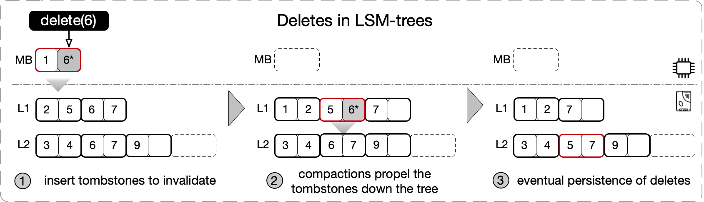
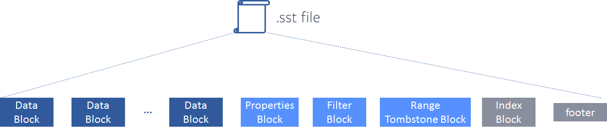
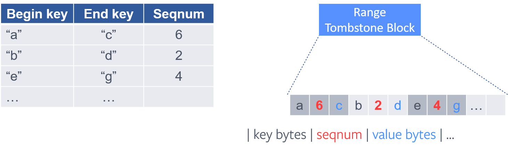
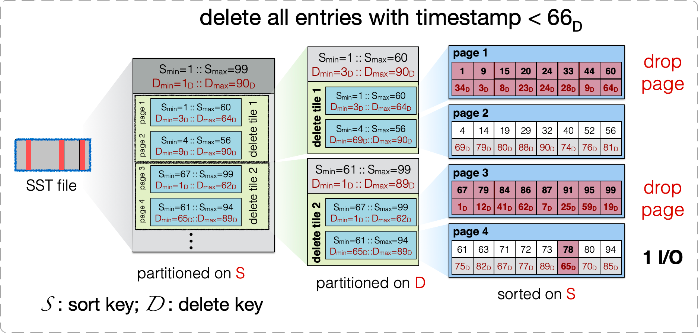
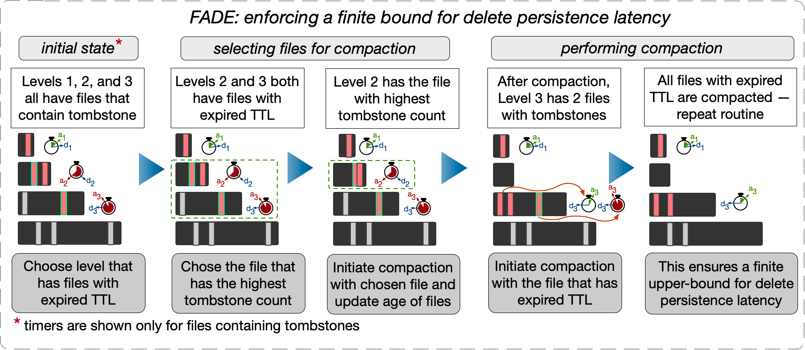
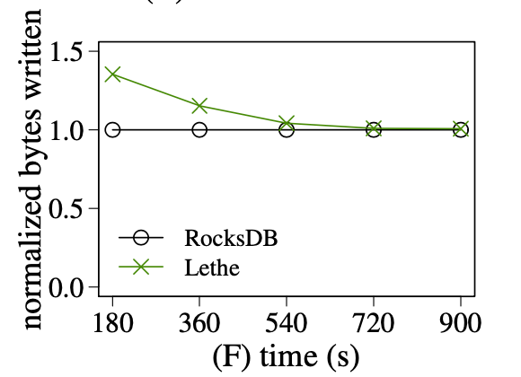

本文的主要内容：
1. 介绍 LSM-tree 在 delete 上面临的一些性能问题。
2. 介绍 RocksDB 和 Lethe 提供的一些优化方案。

首先来回顾一下传统上 LSM-tree 的 delete 是如何做的。

LSM-tree 是一个面向写优化的数据结构，所有写操作都是 out-of-place update 的。它的 delete 操作是通过插入一个 delete tombstone 来 invalid 先前插入的 KV （该 KV 可能被 update 过，有多个物理版本）实现的，之后通过一层又一层的 compaction，直到最后一层，确认 KV 的所有版本都被清理掉后，再将 delete tombstone 清理掉。

很明显，delete tombstone 会带来：
1. 读放大。因为影响 range scan 扫描的数据量，影响 point lookup 的 bloom filter 的准确率。
2. 写放大。因为一层又一层的 compaction，在小小的文件系统上，挖呀挖呀挖，写呀写呀写。
3. 空间放大。最为显著，不必废话。

尤其是在大的 range delete 场景，需要为删除的每一个 KV 生成一个 delete tombstone，大量的 delete tombstone 会导致性能特别地「突出」的差。

此外，业务上通常还会有 time-bounded delete 的需求，要求对用户已删除的数据在限定期限内必须毫无保留的抹除，不留备份。（毕竟你也没办法接受你删除了你在 XX 网盘中存的艳照，结果 XX 网盘偷偷备份下来后续卖给 XXHub 吧。这个行为是有法规约束的，e.g., 欧盟的 GPDR）。传统 LSM-tree 支持 time-bounded delete 有点力不从心，因为不知道哪个 SST 文件里面有快到 deadline 的 delete tombstone，只能周期性地做一把整棵 LSM-tree 的超大 compaction，以蛮力破之。这个做法会带来资源消耗的洪峰，影响在线业务的性能，通常只能在半夜做，因为（清）早（傍）晚会出事。

以上就是传统 LSM-tree 在 delete 上面临的一些性能问题。小结一下，可以分成三个问题：
1. delete tombstone 带来的读写空间放大问题。
2. range delete 中每个删除的 KV 一个 delete tombstone 带来的读写空间放大问题。（这里有意独立问题 1 和 2，是谓解耦。）
3. time-bounded delete 需要整棵 LSM-tree compaction 的性能问题。

好了，弄清了解决什么问题，接下来我们就可以看看这些问题怎么被解决的。

## RocksDB 优化

### 优化 delete tombstone

**手段 1：提前（不必等到最后一层）清理 delete tombstone，如果确认更高的层没有对应的 KV 的话**

方法是在 compaction 期间处理 delete tombstone 的时候，查看一下更高的层的 SST 文件统计信息，如果发现更高层的 SST 文件的 key range 和 delete tombstone 没有重叠，说明更高层不存在这个 key 的别的版本了，这时就可以把这个 delete tombstone 就地正法，直接清理了，不必再等到最后一层了。

**手段 2：优先 compaction 「含 tombstone 率」高的文件**

一般情况下，RocksDB compaction 时会在当前层选择一个和下层重叠最少的文件来往下层 compaction，有利于减小写放大。

考虑到 delete-heavy 场景大量 delete tombstone 带来的可能更严重的各种放大，RocksDB 允许在 compaction 的时候，优先 compaction 含有 delete tombstone 多的文件。因为 RocksDB 的 SST 文件的元数据中已经统计了 delete tombstone 的数量，所以这个「含 tombstone 率」不费吹灰之力即可得到，支持这个 feature 也就顺手之事。

**手段 3：直接清理 delete tomstone 只要它遇上「一」个 KV（不必等到最后一层），前提是用户能保证 KV 插入后不会更新**

这个 feature 需要和用户协作。如果用户能保证 KV 被插入一次后不会更新，那么后续的 delete tombstone 只要遇到这个 KV， 两人就可以一起同归于尽了。在这种情况下不用管别人，都是纯爱，没有第三者插足，夫妻双双把家还就行了。

这个功能最初是应付 MyRocks 的需求而做的，对细节感兴趣的读者可以看看我以前写过的一篇文章：[MyRocks：超越 InnoDB 的存储引擎](https://zhuanlan.zhihu.com/p/573926212)。

### 优化 range delete

为了解决 range delete 生成的大量 delete tombstone 带来的各种放大问题，RocksDB 引入了 range tombstone。

range tombstone 是什么玩意儿？简单理解就是，原来的 delete tombstone 是单个 KV 级别，改进后的 delete tombstone 是一组 KV (range) 级别，称之为 range (delete) tombstone。
原来删除 key ∈ [0, 10000] 区间内的所有 KV，需要插入 10000 个 delete tombstone，而现在，只需要插入一个 range tombstone（记一下 begin key：1, end key: 10000）即可。

range delete 会把 range tombstone 写到 SST 文件中一个专门的区域。读请求在读的时候都要过一遍 range tombstone，以过滤掉删除的数据。

听起来很简单，然而实际操作起来还会遇到 range 重叠的问题。先后删除的重叠的 range（e.g, 先删除 [1000, 5000]，再删除 [1, 10000]），它们对应的 range tombstone 如何存取会影响读写性能。

如果 range tombstone 在写的时候只是简单的追加存下来，那么在读的时候势必要花费很大的代价。比如 point lookup 的时候判断一个 key 是否被删除需要遍历一遍所有的 range tombstone，再比如 range scan 在迭代器扫描数据的时候可能需要实时构建一个线段树之类的玩意来加速区间查询。

为了解决这个问题，RocksDB 采用了对区间进行分段（fragmentation） 的方案，即把区间化整为零，切割成互不重叠的子区间，然后再按照子区间的 begin key 进行排序。这一顿操作下来，就可以在这些子区间上进行二分查找了。 Point lookup 可直接二分查找 key，Range scan 可有序 merage，性能得到了提升。

实现上，RocksDB 的分段 + 排序是在 open SST 文件的时候实时做的，做完之后会把结果缓存下来供后续使用。

很明显，这里还有一些优化空间，如果在 range tombstone 写入的时候做分段 + 排序，那么就不需要后续每次 open SST 文件的时候都做一遍了。可能是这个做法需要变更存储格式，backward compatibility 不好搞，所以 RocksDB 还没有做。

最后再提一下 range tombstone 另外的一个优势：range tombstone 允许在 compaction 的时候直接 **full page drop**，即 compaction 的时候如果判断一个 page 上的数据落在 range tombstone 范围内，那么这个 page 就不需要花费 IO 读取了，直接跳过就行了，这提升了 compaction 的性能。

读到这里，有些读者可能会认为 RocksDB 基本上比较彻底的解决了 range delete 的性能问题。我想说，sometimes naive！range delete 的场景可不止这么简单。

想象一下这样的一个场景，我们有一个用 LSM-tree 存储的一张关系表，该表以用户 id 作为主键，还有一个时间戳列。读写都会依赖主键做索引，此外，该表中的数据会周期性的按时间点做滚动删除（e.g., 删除 30 天之前的数据），这依赖时间戳列。不用说，这张表中的数据得用主键作为 LSM-tree 的 sort-key 了。可是，在这个设计下，根据时间戳列的 range delete，就没办法用上 RocksDB 的这个 range tombstone 优化了，因为数据不是按照时间戳排序的。

用稍微砖业一点的术语描述一下这个问题，RocksDB 只解决的 sort-key(aka primary key) 的 range delete 性能问题，non-sort key(aka secondary key) 的 range delete 性能问题还有待解决。

再加上上文提到的 time-bounded delete 问题，总共是两个问题仍未解决。

正巧，Lethe 就是来解决这两个问题的。

## Lethe 的 KiWi 和 FADE

Lethe 是基于 RocksDB 的一个学术 demo，设计了 KiWi 和 FADE 两个方案解决上面遗留的这两个问题。Lethe 有 SIGMOD 上一篇文章：《Lethe: A Tunable Delete-Aware LSM Engine》，是本文的主要参考资料之一，感兴趣的读者也可直接去翻翻看。

### KiWi 优化 non-sort key 的 range delete 问题

上图是 KiWi 对 SST 文件格式的修改。原本 SST 文件是一个两层的结构：file -> page(block)，文件内的数据按 sort-key 排序。KiWi 改成了一个三层结构：file -> delete tile -> page(block)， delete tile 间按照 sort-key 排序，page 间按照 non-sort key(delete key) 排序，page 内又按照 sort-key 排序。

在这个格式下，KiWi 的 fence pointer 是 delete tile 级别的（RocksDB 是 block 级别的），Bloomfilter 与 RocksDB 一样是 page 级别的。此外，在 delete tile 内部还有一个 page 级别的 delete fence pointers，用来配合 delete tombstone 在 compaction 的时候做 full page drop。

在这个方案下：
1. range delete：sort key 仍然可以用 delete tombstone。non-sort key 也可以直接用上 range tombstone，因为数据局部（delete tile 内）是按照 non-sort key 排序的。
2. point lookup：先读 fence pointer 找到 delete tile，再在 delete tile 内部遍历每个 page 的 bloomfilter 确认 key 是否在对应的 page 中，如果在就读取该 page（可能要读多个）。显然，相比 RocksDB 能按照 page 级别 fence pointer 精准定位到一个 page 的方案来说，这个方案的 point lookup 性能是有所下降的。不过考虑到遍历 bloomfilter 是纯内存操作，加上 bloomfilter 一般误判率很低，这里性能也就差不了多少了，可以接受。
3. range scan：对 sort key 的 range scan 的性能影响是比较大的。尤其是小的 range scan（扫描的数据完全落入一个 delete tile 中），定位到 delete tile 后，会发现 delete tile 内的 page 间没有按照 sort-key 排序，因此要 scan 的目标 range 中的数据会分散在更多的 page 中，需要更多的 IO。对于 non-sort key 的 range scan 性能是有所提升的，因为数据局部按 non-sort key 排序了，形成了一个有序索引。

KiWi 总体上是牺牲了 sort key range scan 的性能，换取了 non-sort key range delete，compaction(full page drop) 的性能。

### FADE 解决 time-bounded delete 问题

这个方案说起来其实比较简单。

大致是做了这么几件事：
1. SST 文件增加元数据，记一下过期时间。仅当 SST 文件中含有 delete tombstone 时，这个过期时间才起作用。
2. SST 文件过期时，compact 到下一层。
3. 从最低层到最高层，SST 文件的过期时间指数递增，满足 delete tombstone 在各个层消耗的时间加起来即为这个 delete 操作设定的 time-bouned 时间。

呃，没了，实现 time-bounded delete 就这么简单。。。

对于这个方案，我比较关注的是按照过期时间来选择要 compact 的文件而不是像 RocksDB 一样选择与下层重叠最少的文件会不会造成非常大的写放大。

上图为 Lethe 的实验数据，其中 normalized bytes written 是写的字节数，用来衡量写放大。从实验中得到的结论是： 
1. Lethe 的写放大确实高于 RocksDB，它的 normalized bytes written 在时间上的累积量更大。
2. Lethe 一开始会有很大的（瞬时）写放大，随着运行时间的增长，（瞬时）写放大会减小到与 RocksDB 差不多，这是因为无效的数据（包括 delete tobstone + 它对应的 KVs）都被尽早的清理的，后续的 compaction 处理的数据量变小了。

换我的句话说，Lethe 很莽。一开始很莽，多干了很多活，幸运的是，这堆活对后面的活有一点帮助。后面仍然很莽，但由于受益于前面的帮助，干的活和别人没多大差别了。

总的来看，Lethe 付出了日常 compaction 多了一些写放大的代价，让我们不再需要动不动周期性地做一个整棵 LSM-tree 的 compaction 来实现 time-bounded delete 了，这有利于 consistency performance，有利于用户体验，有利于赚用户的钱。那这么看，是个好方案！

## 总结
唉，内容就是这么些了，就不总结了，毕竟咱的文章也没有几个人点赞收藏转发一键三连，咱的知乎/微信公众号（ID：黄金架构师）也没几个人关注，就这样烂尾应该也没人注意到吧 :)

## 参考
1. 《DeleteRange: A New Native RocksDB Operation》
2. 《Lethe: A Tunable Delete-Aware LSM Engine》
3.  https://disc-projects.bu.edu/lethe/